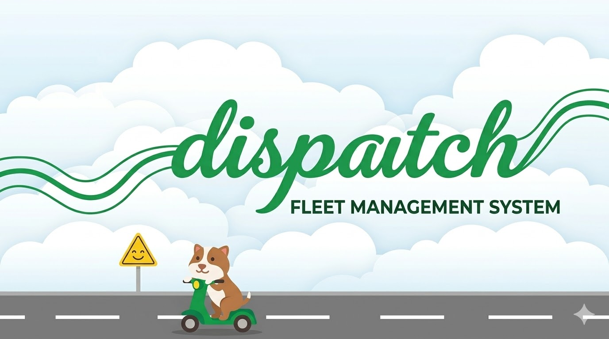

<div align="center">

# Dispatch


**Fleet Management & Migration System**

A fleet management system built on Zoho Creator (Deluge + JavaScript) for tracking rental vehicles, driver assignments, maintenance scheduling, and fleet utilization analytics — with a documented migration path to Salesforce.

Built as a portfolio project mirroring real-world fleet operations at ride-hailing rental companies.

---

</div>

## Overview

Dispatch manages the full lifecycle of a rental vehicle fleet:

- **Vehicle Registry** — Track vehicles by VIN, plate, status, mileage, COE/insurance expiry
- **Driver Management** — Driver records, license tracking, status management
- **Rental Assignments** — Link drivers to vehicles with validation (no double-assigns, status checks)
- **Maintenance Scheduling** — Service history, cost tracking, automated reminders
- **Fleet Dashboards** — KPI cards, utilization heatmaps, maintenance timelines, revenue vs cost
- **Salesforce Migration** — Field mapping, API mapping, Python bulk migration prototype

## Tech Stack

| Layer | Technology |
|-------|------------|
| Platform | Zoho Creator (Professional) |
| Backend Logic | Deluge |
| Custom UI | JavaScript (React custom widgets) |
| Dashboards | Zoho Creator Reports + React (Chart.js) |
| Migration Target | Salesforce Developer Edition |
| Migration Script | Python (simple-salesforce, pandas) |
| Version Control | Git + GitHub |

## Architecture

To be added via .drawio screenshot.

## Project Structure

```
fleet-management-system/
├── dispatch/
│   └── docs/
├── migration/
├── widgets/
├── data/
├── assets/
│   └── dispatch-logo.jpg         # Banner for the Dispatch project
└── README.md
```

## Data Model

To be updated upon data ingestion.

## Dashboards

| Dashboard | Type | Purpose |
|-----------|------|---------|
| Fleet Overview | React widget | KPI cards, status breakdown, revenue summary |
| Utilization Heatmap | React widget | Calendar view of fleet usage over time |
| Maintenance Timeline | React widget | Upcoming services, cost trends, overdue alerts |
| Fleet Summary | Zoho report | Tabular vehicle list with filters |
| Revenue vs Cost | Zoho report | Profitability per vehicle |

## Salesforce Migration

To be updated.

## Development

### Branches

| Branch | Scope |
|--------|-------|
| `main` | Stable, docs, seed data |
| `feat/data-model` | Zoho Creator forms + tables |
| `feat/automation` | Deluge validation + status sync |
| `feat/scheduled-tasks` | Reminders + utilization calc |
| `feat/reports` | Built-in Zoho reports |
| `feat/widgets` | React custom widgets |
| `feat/salesforce-migration` | SF prototype + migration script |
| `feat/uat` | UAT execution + results |

---

<div align="center">

**Built by Jason Matthew Suhari**

[](https://jasonsuhari.com)
[](https://linkedin.com/in/jasonmatthewsuhari)
[](https://github.com/jasonmatthewsuhari)

</div>
